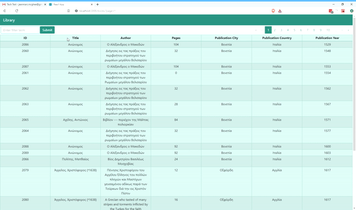

# Library-list

## Description 

A small application using React, React-Bootstrap, Recoil and Axio to display data from a JSON API

## Installation

### Requirements
    1. [NodeJs 12+](https://nodejs.org/en/)
    2. [Yarn](https://yarnpkg.com/)

### Install Script
After Installing all requirements, please run ``` yarn install ``` in your terminal shell.

## How to Run

Once all packages have been downloaded you can start the app by running ```yarn start```.

## Demo

